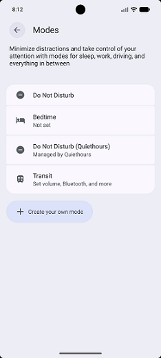

# QuietHours

QuietHours is a native Android automation application that schedules and manages Do Not Disturb (DND) mode based on user-defined quiet hours.

It demonstrates system-level Android development, background scheduling with WorkManager, and modern UI implementation using Jetpack Compose.

---

## Screenshot



## ✨ Features

- Automatically schedules Do Not Disturb during user-defined quiet hours
- Allows incoming calls while suppressing other notifications
- Manual override via in-app toggle
- Persistent scheduling across device restarts
- Simple, minimal Jetpack Compose UI

---

## 🏗️ Architecture & Implementation

QuietHours is structured as a lightweight Android system automation application with clear separation of concerns:

### UI Layer
- Jetpack Compose-based interface
- Reactive state management for toggle and schedule configuration

### System Layer
- Android NotificationManager API for Do Not Disturb control
- Runtime permission handling for notification policy access

### Scheduling Layer
- WorkManager-based scheduling for reliable background execution
- Time-based delay calculation for enable/disable events
- Ensures execution survives Doze mode and background restrictions

### Data Layer
- SharedPreferences for local persistence of user settings

---

## ⚙️ Tech Stack

- Kotlin
- Jetpack Compose
- WorkManager
- Android NotificationManager API
- Android SDK
- Gradle

---

## 🔐 Permissions Used

- `ACCESS_NOTIFICATION_POLICY` – required to modify Do Not Disturb settings
- `RECEIVE_BOOT_COMPLETED` – allows restoration of scheduled behavior after device reboot

---

## 🧠 Key Engineering Concepts

- Android system service integration
- Background task scheduling with WorkManager
- Time-based automation logic
- Persistent local state management
- Permission-aware system feature gating
- Declarative UI with Jetpack Compose

---

## 🚧 Current Status

Stable working Android prototype demonstrating:

- System-level Do Not Disturb control
- Automated scheduling via WorkManager
- Persistent configuration handling
- Manual override and state management

---

## 🚀 Build Instructions

1. Clone repository:
   ```bash
   git clone https://github.com/yourusername/quiethours.git
2. Open in Android Studio
3. Sync Gradle
4. Run on physical device or emulator
5. Grant Do Not Disturb permission when prompted